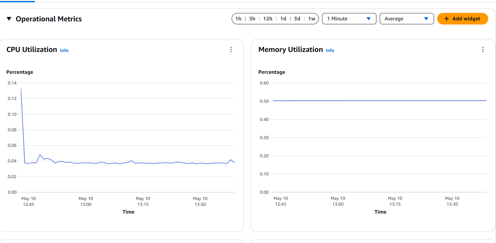
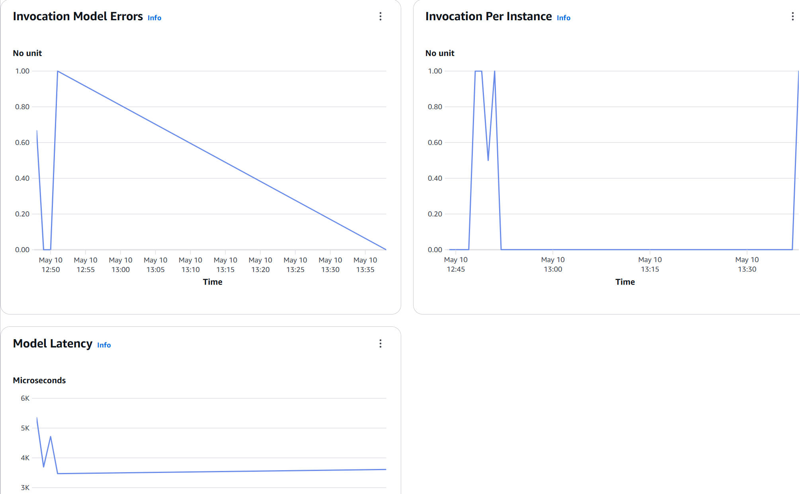

# Deploying ML Models with AWS SageMaker


<p align="center">
  
</p>

<p align="center">
  <a href="https://aws.amazon.com/campaigns/sagemaker/">Source: AWS SageMaker Campaign</a>
</p>


## Introduction

This guide walks through the process of deploying a pre-trained model as a production-ready endpoint using AWS SageMaker.

Writer notes: Even if AWS is highly talented, it's not suitable for small-cap projects due to the complexity. From my perspective, this is my first time meeting AWS and it was a tricky experience, like they built the platform intentionally to not be usable or make it complex. Or this is normal, I don't know, but now I understand the value of our AWS architect friends at work :)

AWS SageMaker simplifies machine learning deployment/training by providing managed infrastructure for hosting models. However, the path from a trained model to a functional endpoint involves multiple components working together seamlessly. In this guide, we will try to connect all of them one by one.

I'm sure there are countless methods on AWS to deploy models via REST API. In this project, we will use custom inference code: https://docs.aws.amazon.com/sagemaker/latest/dg/-algorithms-inference-code.html


By following this guide, you'll learn how to:

-   Package inference code into a Docker container following SageMaker specifications
-   Upload  container to Amazon ECR
-   Configure and deploy a SageMaker endpoint
-   Test  deployed model with real-time inference requests

<p align="center">
  
</p>
<p  align="center"> <a  href="https://tutorialsdojo.com/deploying-a-serverless-inference-endpoint-with-amazon-sagemaker/">Source: Tutorials Dojo - Deploying a Serverless Inference Endpoint</a> </p>

## Project Overview

This project focuses on deploying a pre-trained machine learning model to AWS SageMaker. Rather than covering model training, we emphasize the deployment process—turning an existing model into a scalable, accessible API endpoint that can serve predictions via HTTP requests.

**Key Components:**

-   **Docker Container**: Packages Server and inference code; depending on the situation, it can also contain the model
-   **Amazon ECR**: Stores  container image
-   **S3 Buckets**: Artifact Storage; Models, Scalers
-   **SageMaker Model**: References  container and model artifacts
-   **SageMaker Endpoint Config**: Pre-built configurations for seamless endpoint updates
-   **SageMaker Endpoint**: Hosts  model for real-time inference
-   **AWS IAM (Identity and Access Management)**: Manages permissions across services

**Implementation Flow:**

1.  Containerize the inference code with Docker
2.  Push the container to Amazon ECR
3.  Create SageMaker model, endpoint configuration, and endpoint
4.  Test the deployed endpoint with sample data
5.  Clean up resources to avoid unnecessary charges

## Prerequisites

Before starting this implementation, ensure you have:

-   **AWS Account**: Active account with appropriate permissions. In this guide, I will use my root account, but creating another user is highly suggested. If you create a user, you must give proper access to S3, SageMaker, etc.
-   **Pre-trained Model**: Serialized model file (e.g., model.pkl)
-   **Local Development Environment**:
    -   Python 3.6+ installed
    -   Docker installed and running
    -   AWS CLI V2 configured with credentials

## Step 1: Building the Inference Container

SageMaker runs  model inside a Docker container, which must implement specific HTTP endpoints to integrate with SageMaker's infrastructure.

### 1.1 Understanding SageMaker's Container Contract

SageMaker expects  container to implement two main endpoints:

-   **/ping** (GET): Health check endpoint that returns HTTP 200 when the container is ready
-   **/invocations** (POST): Prediction endpoint that accepts input data and returns predictions

The container must listen on port 8080 and handle both JSON and CSV input formats efficiently.

### 1.2 Creating the Project Structure

```bash
git clone https://github.com/mtech00/MLE-24-25.git
cd MLE-24-25/module-6-cloud-endpoint-aws-optional/

```

Repo structure:

```
.
├── Dockerfile
├── inference.py
├── model.pkl
├── requirements.txt
├── test_endpoint.py
└── train.py

```

### 1.3 Writing the Inference Script

`inference.py`

```python
import os
import json
import flask
import pickle
import numpy as np

# Define paths
prefix = '/opt/ml/'
model_path = os.path.join(prefix, 'model/model.pkl')
model = None

def load_model():
    """Load model at startup"""
    global model
    print("Loading model from: {}".format(model_path))
    with open(model_path, 'rb') as f:
        model = pickle.load(f)
    print("Model loaded successfully")
    return model

# Flask app 
app = flask.Flask(__name__)

@app.route('/ping', methods=['GET'])
def ping():
    """Health check - SageMaker calls this to check if container is healthy"""
    # Check if model is loaded
    if model is None:
        try:
            load_model()
        except Exception as e:
            print(f"Error loading model: {str(e)}")
            return flask.Response(
                response=json.dumps({"status": "unhealthy", "error": str(e)}),
                status=500,
                mimetype='application/json'
            )
    return flask.Response(
        response=json.dumps({"status": "healthy"}),
        status=200,
        mimetype='application/json'
    )

@app.route('/invocations', methods=['POST'])
def predict():
    """Prediction endpoint - SageMaker calls this for predictions"""
    # Load model if not loaded
    if model is None:
        load_model()
           
    # Parse input data
    if flask.request.content_type == 'application/json':
        try:
            data = flask.request.get_json()
            print("Received data: {}".format(data))
            
            # Expect input in format: {"features": [[val1, val2, ...]]}
            features = np.array(data['features'])
        except Exception as e:
            return flask.Response(
                response=json.dumps({"error": f"Failed to parse input: {str(e)}"}),
                status=400,
                mimetype='application/json'
            )
    else:
        return flask.Response(
            response=json.dumps({"error": "This predictor only supports JSON data"}),
            status=415,
            mimetype='application/json'
        )
           
    try:
        predictions = model.predict(features)
        result = {
            'predictions': predictions.tolist()
        }
        return flask.Response(
            response=json.dumps(result),
            status=200,
            mimetype='application/json'
        )
    except Exception as e:
        print(f"Prediction error: {str(e)}")
        return flask.Response(
            response=json.dumps({"error": str(e)}),
            status=500,
            mimetype='application/json'
        )

if __name__ == '__main__':
    print("Starting application server")
    load_model()
    app.run(host='0.0.0.0', port=8080)

```

This script implements both required SageMaker endpoints:

-   The `/ping` endpoint performs a health check
-   The `/invocations` endpoint accepts features as input and returns predictions
-   Error handling is implemented for various failure scenarios
-   The model is loaded at startup and kept in memory for faster predictions rather than reloading every time

### 1.4 Specifying Dependencies

Create `requirements.txt` to list  container's dependencies:

```
flask==2.0.1
numpy==1.22.0
scikit-learn==1.0.2

```

Adjust these packages based on  specific model's requirements. Include any additional libraries  model needs for inference.

### 1.5 Creating the Dockerfile

Create a `Dockerfile` to define how  container is built:

```dockerfile
FROM python:3.9-slim

# Working directory 
WORKDIR /opt/program

# Install dependencies
COPY requirements.txt .
RUN pip install --no-cache-dir -r requirements.txt

# Copy inference code
COPY inference.py .

# Environment variables
ENV PYTHONUNBUFFERED=TRUE 
ENV PYTHONDONTWRITEBYTECODE=TRUE
ENV PATH="/opt/program:${PATH}"

# Create model directory
RUN mkdir -p /opt/ml/model

# Port for SageMaker to communicate
EXPOSE 8080

# Command to run when container starts
ENTRYPOINT ["python", "inference.py"]

```

This Dockerfile: ENV PYTHONUNBUFFERED=TRUE # Ensures logs appear in real-time without Python buffering. It helps AWS track errors and bugs immediately without lag.

ENV PYTHONDONTWRITEBYTECODE=TRUE # Prevents creation of .pyc files, which aren't useful in containers. This is because compiled byte codes act like caching after the first creation. If we call again, it helps faster builds, but in containers, every environment is new and clean, so it doesn't help here. In local development and production when many Python files are imported many times → improves startup time.

Large apps with many modules → speeds up loading.

-   Exposes port 8080 for SageMaker communication
-   Specifies the entry point to start the Flask application

```
# We use the exec form of ENTRYPOINT ["python", "inference.py"] rather than 
# the shell form (ENTRYPOINT python inference.py) because:
# - Exec form doesn't start a shell, running the command directly
# - Properly receives signals like SIGTERM for graceful shutdown
# - This is critical for proper container lifecycle management in SageMaker

```

Additional tools about entrypoint: https://github.com/krallin/tini

### 1.6 Creating model file

I provided a model file for this demo, but if you want to recreate it, remember it must be the same artifact format for inference and training.

```
python train.py

```

### 1.6 Building and Testing the Container Locally

Build the Docker image:

```bash
docker build -t sagemaker-model:v1 .

```

Test the container locally to ensure it works before deploying to AWS:

```bash

# Run the container
docker run -d -p 8080:8080 --name sagemaker-test sagemaker-model:v1

# Now for the first creation of container, it will fail due to not finding model.pkl 

# Copy  model file to the container
docker cp model.pkl sagemaker-test:/opt/ml/model/

# Restart the container
docker restart sagemaker-test

# Test the ping endpoint
curl http://localhost:8080/ping

{"status": "healthy"}


# Test the prediction endpoint
curl -X POST http://localhost:8080/invocations \
  -H "Content-Type: application/json" \
  -d '{"features": [[5.1, 3.5, 1.4, 0.2]]}'
{"predictions": [0]}

# Stop and remove the test container
docker stop sagemaker-test
docker rm sagemaker-test

```

Verifying the container locally helps identify issues before AWS deployment, saving time and resources.

## Step 2: Container Management with ECR

Amazon Elastic Container Registry (ECR) stores and manages Docker images. You'll upload  inference container to ECR so SageMaker can access it.

### 2.1 Setting Up AWS CLI

Ensure AWS CLI is installed and configured with  credentials. In this demo, I used a free tier root user:

```bash
# Check AWS CLI installation
aws --version

# Configure AWS CLI with  credentials
aws configure

```

You'll need to enter:

-   AWS Access Key ID
-   AWS Secret Access Key
-   Default region (e.g., eu-north-1)
-   Output format (json)

### 2.2 Creating an ECR Repository

Create a repository to store  container image:

```bash
# Store AWS account ID 
AWS_ACCOUNT_ID=$(aws sts get-caller-identity --query Account --output text)
AWS_REGION=eu-north-1  # Change to  preferred region

# Create ECR repository
aws ecr create-repository \
    --repository-name sagemaker-model \
    --region $AWS_REGION

```

This creates a repository named `sagemaker-model` in  specified AWS region.

### 2.3 Authenticating to ECR

Before pushing images, authenticate  Docker client to  ECR registry:

```bash
# Get ECR login token and use it to authenticate Docker
aws ecr get-login-password --region $AWS_REGION | docker login --username AWS --password-stdin $AWS_ACCOUNT_ID.dkr.ecr.$AWS_REGION.amazonaws.com

```

This command retrieves a token and uses it to authenticate  Docker client with ECR.

### 2.4 Tagging and Pushing the Image

Tag  local image with the ECR repository URI, then push it to ECR:

For tagging, using model numbers will be helpful when updating the endpoint. If we use the latest tag while updating incrementally, model 2 will have the latest tag at the same time, which is problematic.

```bash
# Tag the image for ECR
docker tag sagemaker-model:v1 $AWS_ACCOUNT_ID.dkr.ecr.$AWS_REGION.amazonaws.com/sagemaker-model:v1

# Push image to ECR
docker push $AWS_ACCOUNT_ID.dkr.ecr.$AWS_REGION.amazonaws.com/sagemaker-model:v1

```

The push process may take several minutes depending on  internet connection and image size.

### 2.5 Verifying the Upload

Confirm  image is in ECR:

```bash
# List images in  repository
aws ecr list-images --repository-name sagemaker-model --region $AWS_REGION

```

You should see  image listed with the tag `v1`.

## Step 3: SageMaker Infrastructure Setup

Now that  container is in ECR, you'll set up the SageMaker infrastructure to host  model.

### 3.1 Uploading the Model to S3

SageMaker loads model artifacts from Amazon S3. Upload  model file:

```bash
# Before uploading to S3, SageMaker expects tar ball format artifacts
tar -czvf model.tar.gz model.pkl 

# Create S3 bucket (bucket names must be globally unique)
BUCKET_NAME=sagemaker-model-bucket-$AWS_ACCOUNT_ID
aws s3 mb s3://$BUCKET_NAME --region $AWS_REGION

# Upload model file
aws s3 cp model.tar.gz s3://$BUCKET_NAME/model.tar.gz

```

S3 bucket names must be globally unique, so we've added  account ID to make it unique.

### 3.2 Creating an IAM Role for SageMaker

SageMaker needs permissions to access  ECR image and S3 model artifacts:

```bash
# Create trust policy file
cat > trust-policy.json << EOF
{
  "Version": "2012-10-17",
  "Statement": [
    {
      "Effect": "Allow",
      "Principal": {
        "Service": "sagemaker.amazonaws.com"
      },
      "Action": "sts:AssumeRole"
    }
  ]
}
EOF

# Create IAM role
aws iam create-role --role-name SageMakerRole \
  --assume-role-policy-document file://trust-policy.json

# Attach necessary policies
aws iam attach-role-policy --role-name SageMakerRole \
  --policy-arn arn:aws:iam::aws:policy/AmazonSageMakerFullAccess

aws iam attach-role-policy --role-name SageMakerRole \
  --policy-arn arn:aws:iam::aws:policy/AmazonS3FullAccess

aws iam attach-role-policy --role-name SageMakerRole \
  --policy-arn arn:aws:iam::aws:policy/AmazonECR-FullAccess

# Get role ARN for later use
ROLE_ARN=$(aws iam get-role --role-name SageMakerRole --query 'Role.Arn' --output text)
echo "Role ARN: $ROLE_ARN"

```

This creates a role named `SageMakerRole` with permissions to access SageMaker, S3, and ECR. Store the role ARN for the next steps.

### 3.3 Creating a SageMaker Model

A SageMaker model connects  container image with  model artifacts:

```bash
# Create model definition file
cat > create-model.json << EOF
{
  "ModelName": "my-sagemaker-model",
  "PrimaryContainer": {
    "Image": "$AWS_ACCOUNT_ID.dkr.ecr.$AWS_REGION.amazonaws.com/sagemaker-model:v1",
    "ModelDataUrl": "s3://$BUCKET_NAME/model.tar.gz"
  },
  "ExecutionRoleArn": "$ROLE_ARN"
}
EOF

# Create the model
aws sagemaker create-model \
  --cli-input-json file://create-model.json \
  --region $AWS_REGION

```

This command creates a SageMaker model named `my-sagemaker-model` that points to  ECR container image and S3 model artifact.

### 3.4 Creating an Endpoint Configuration

An endpoint configuration specifies how  model should be deployed. We need these config files when updating the endpoint. We will create another endpoint change flow gradually rather than all at once:

```bash
# Create endpoint configuration file
cat > endpoint-config.json << EOF
{
  "EndpointConfigName": "my-model-endpoint-config",
  "ProductionVariants": [
    {
      "VariantName": "AllTraffic",
      "ModelName": "my-sagemaker-model",
      "InitialInstanceCount": 1,
      "InstanceType": "ml.m5.xlarge"
    }
  ]
}
EOF

# Create endpoint configuration
aws sagemaker create-endpoint-config \
  --cli-input-json file://endpoint-config.json \
  --region $AWS_REGION

```

This configuration:

-   Names  configuration `my-model-endpoint-config`
-   Deploys 1 instance of type `ml.m5.xlarge`. I used this because it is the only option for the free tier. Check  specific region to see which instances are available for the free tier.
-   Directs all traffic to  model

### 3.5 Creating a SageMaker Endpoint

Finally, create the endpoint that will serve  model:

```bash
# Create endpoint
aws sagemaker create-endpoint \
  --endpoint-name my-model-endpoint \
  --endpoint-config-name my-model-endpoint-config \
  --region $AWS_REGION

```

### 3.6 Monitoring Endpoint Deployment

Endpoint creation takes several minutes. Monitor the status:

```bash
# Check endpoint status
aws sagemaker describe-endpoint \
  --endpoint-name my-model-endpoint \
  --region $AWS_REGION \
  --query "EndpointStatus"
"InService"

```

Wait until the status changes from `Creating` to `InService` before proceeding. It can take up to 10 minutes.

## Step 4: Endpoint Testing and Validation

Once  endpoint is deployed, you can test it by sending inference requests.

### 4.1 Testing with AWS CLI

The simplest way to test  endpoint is with AWS CLI:

```bash
# Create a test input file
cat > test-data.json << EOF
{"features": [[5.1, 3.5, 1.4, 0.2]]}
EOF

# Invoke endpoint
aws sagemaker-runtime invoke-endpoint \
  --endpoint-name my-model-endpoint \
  --content-type application/json \
  --body fileb://test-data.json \
  --region $AWS_REGION \
  output.json

# View results
cat output.json
{"predictions": [0]}

```

A tricky point here: don't use "file", use "fileb". File binary can handle JSON data more properly on terminal requests. This sends a request with one sample to  endpoint and saves the response to `output.json`.

### 4.2 Testing with Python

For more detailed testing, use Python with the AWS SDK (boto3):

```python
import boto3
import json

# Create SageMaker runtime client
client = boto3.client('sagemaker-runtime', region_name='eu-north-1')  # 

# Sample data - modify with features appropriate for  model
payload = json.dumps({"features": [[5.1, 3.5, 1.4, 0.2]]})

# Call endpoint
response = client.invoke_endpoint(
    EndpointName='my-model-endpoint',
    ContentType='application/json',
    Body=payload
)

# Parse response
result = json.loads(response['Body'].read().decode())
print("Endpoint response:")
print(json.dumps(result, indent=2))

```

Save this script as `test_endpoint.py` and run it:

```bash
pip install boto3
python test_endpoint.py
Endpoint response:
{
  "predictions": [
    0
  ]
}

```
Final Structure
```
.
├── create-model.json
├── Dockerfile
├── endpoint-config.json
├── inference.py
├── model.pkl
├── model.tar.gz
├── output.json
├── requirements.txt
├── test-data.json
├── test_endpoint.py
├── train.py
└── trust-policy.json
```
### 4.4 Monitoring in AWS Console

The AWS Console provides detailed monitoring for  endpoint:

1.  Open the AWS Console and navigate to SageMaker
2.  Select "Endpoints" from the left sidebar
3.  Click on  endpoint name
4.  View the "Monitoring" tab for metrics like:
    -   Invocation count
    -   Invocation errors
    -   Model latency
    -   Instance metrics (CPU, memory, etc.)


<p align="center">
  <br/>
  <em>Figure 1</em>
</p>

<p align="center">
  <br/>
  <em>Figure 2</em>
</p>


Set up CloudWatch alarms for critical metrics to monitor  endpoint's health in production.

## Step 5: Resource Cleanup

To avoid unnecessary charges, delete all resources when you're done:

### 5.1 Deleting the Endpoint

```bash
# Delete endpoint
aws sagemaker delete-endpoint \
  --endpoint-name my-model-endpoint \
  --region $AWS_REGION

# Verify endpoint is deleted
aws sagemaker list-endpoints --region $AWS_REGION

```

### 5.2 Deleting the Endpoint Configuration

```bash
# Delete endpoint configuration
aws sagemaker delete-endpoint-config \
  --endpoint-config-name my-model-endpoint-config \
  --region $AWS_REGION

# Verify endpoint configuration is deleted
aws sagemaker list-endpoint-configs --region $AWS_REGION

```

### 5.3 Deleting the Model

```bash
# Delete model
aws sagemaker delete-model \
  --model-name my-sagemaker-model \
  --region $AWS_REGION

# Verify model is deleted
aws sagemaker list-models --region $AWS_REGION

```

### 5.4 Deleting the ECR Repository

```bash
# Delete ECR repository
aws ecr delete-repository \
  --repository-name sagemaker-model \
  --force \
  --region $AWS_REGION

# Verify repository is deleted
aws ecr describe-repositories --region $AWS_REGION

```

The `--force` flag deletes the repository even if it contains images.

### 5.5 Deleting S3 Objects and Bucket

```bash
# Delete model file from S3
aws s3 rm s3://$BUCKET_NAME/model.tar.gz

# Delete S3 bucket
aws s3 rb s3://$BUCKET_NAME --force

# Verify bucket is deleted
aws s3 ls

```

### 5.6 Cleaning Up IAM Role

```bash
# Detach policies from role
aws iam detach-role-policy \
  --role-name SageMakerRole \
  --policy-arn arn:aws:iam::aws:policy/AmazonSageMakerFullAccess

aws iam detach-role-policy \
  --role-name SageMakerRole \
  --policy-arn arn:aws:iam::aws:policy/AmazonS3FullAccess

aws iam detach-role-policy \
  --role-name SageMakerRole \
  --policy-arn arn:aws:iam::aws:policy/AmazonECR-FullAccess

# Delete role
aws iam delete-role --role-name SageMakerRole

# Verify role is deleted
aws iam list-roles | grep SageMakerRole

```

Always confirm that all resources are properly deleted to avoid unexpected charges.

## Performance Considerations

### Scaling Strategies

In this demo, we used real-time deploying, but another option is serverless deploy. Depending on  needs, it can help much better, but if you need low latency, real-time config will be better. Another difference is about artifacts. If you want to use the serverless option, you must embed the model into the Docker image, not external artifacts.

If  requests are bigger than the single request can handle, take a look at: HTTP chunked encoding


<p align="center">
  
</p>
<p align="center">
  <a href="https://tutorialsdojo.com/deploying-a-serverless-inference-endpoint-with-amazon-sagemaker/">Source: Tutorials Dojo - Deploying a Serverless Inference Endpoint</a>
</p>

### Authentication and Authorization

1.  **Use IAM Roles with Least Privilege**:
    -   Create specific roles for each function
    -   Grant only necessary permissions
    -   Regularly audit and rotate credentials


## Resources and References


- [AWS SageMaker Documentation](https://docs.aws.amazon.com/sagemaker/)
- [Docker Best Practices](https://docs.docker.com/develop/develop-images/dockerfile_best-practices/)
- [Flask Documentation](https://flask.palletsprojects.com/)
- [AWS ECR User Guide](https://docs.aws.amazon.com/AmazonECR/latest/userguide/)
- [AWS IAM Best Practices](https://docs.aws.amazon.com/IAM/latest/UserGuide/best-practices.html)
- [SageMaker Docker Containers Guide](https://docs.aws.amazon.com/sagemaker/latest/dg/docker-containers.html)
- [Deploying a Serverless Inference Endpoint](https://tutorialsdojo.com/deploying-a-serverless-inference-endpoint-with-amazon-sagemaker/)


