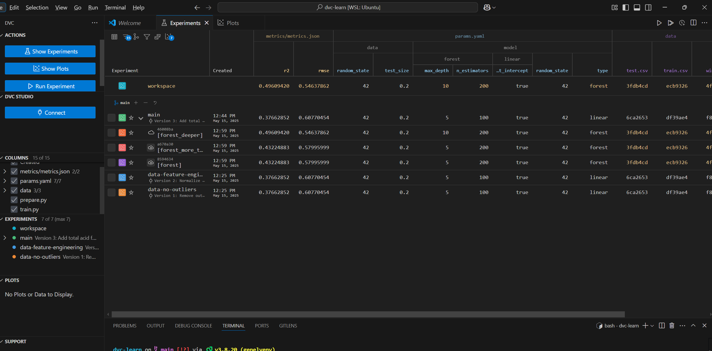

<p align="center">
  <a href="https://medium.com/@sachinsoni600517/understanding-dvc-a-practical-guide-to-data-version-control-04c105413ab4">
    
  </a>
</p>

<p align="center">
  <i>Source: <a href="https://medium.com/@sachinsoni600517/understanding-dvc-a-practical-guide-to-data-version-control-04c105413ab4">Understanding DVC: A Practical Guide to Data Version Control by Sachin Soni</a></i>
</p>


# DVC: Data Version Control Time Travel on Data


Since data is constantly changing during experimentation in data science projects, we need to lock specific data versions or ensure reproducibility across team members. In personal projects, changing a file's path or name might be sufficient, but these are fragile practices that will immediately fail in production environments with teams.

The need for different data versions is a common requirement, but how can we achieve this effectively? There's an ongoing debate about this topic. Some people argue that only source data is essential, and any pipeline intermediate files should be considered ephemeral and regenerable. Is this a fallacy? I don't think so, but it heavily depends on specific circumstances, project scale, and team working principles.

When teams collaborate on a project, having consistent approaches to data versioning becomes crucial to maintain productivity and ensure reproducible results. The right solution balances flexibility, reproducibility, and practicality based on your team's unique workflow.


[Reddit comment thread](https://www.reddit.com/r/MachineLearning/comments/mrb096/comment/gun8aa0/?utm_source=share&utm_medium=web3x&utm_name=web3xcss&utm_term=1&utm_content=share_button) " I've seen people advocate for data versioning to facilitate data sharing, but the only data that you should share is raw data. Any processed dataset whose origin is unknown should not be used for any downstream tasks (such as training a model) because there is no way to reproduce it from raw data."


I agree with the versioning concept, but what methods are available? If you're working on big data solutions, you'll probably have system-level time travel options thanks to Apache Iceberg / Delta Lake. If you're curious, you can check out my Medium blog about that. : dbrain.techx (2024). "Real-Time Data Ingestion in Big Data Environments." [Medium](https://medium.com/@dbrain.techx/real-time-data-ingestion-in-big-data-environments-965915484e5d)


Now these are the system-level tools, and if we need more handy tools, DVC comes into play. Data Version Control helps to track versions of data with a Git-like control board based on Git repositories. They describe themselves as:

"DVC is a 'Makefile' system for machine learning projects!" [https://dvc.org/doc/start/data-pipelines/data-pipelines](https://dvc.org/doc/start/data-pipelines/data-pipelines)

Even if the main function is to track versions of files, it also has some features for tracking experiments, like a minimized MLflow. In this project, we will walk through the fundamentals of DVC, showing you how to version data, create reproducible pipelines, and manage experiments effectively.


<p align="center">
  <a href="https://medium.com/@sachinsoni600517/understanding-dvc-a-practical-guide-to-data-version-control-04c105413ab4">
    
  </a>
</p>

<p align="center">
  <i>Source: <a href="https://medium.com/@sachinsoni600517/understanding-dvc-a-practical-guide-to-data-version-control-04c105413ab4">Understanding DVC: A Practical Guide to Data Version Control</a> by Sachin Soni</i>
</p>


## Project Setup
Firstly, clone this repo, create and enter the virtual environment, after that install requirements.

A key point here: while installing DVC, you also need to specify some of the remote options like dvc[s3]. Reference: https://dvc.org/doc/install/linux#install-with-pip

Also, if you plan to use Google Drive like in the documents, I don't recommend it: "Update 8/21/24: Google has made policy adjustments which have made it impossible to authenticate GDrive with DVC. For information on the workaround, see this issue: https://github.com/iterative/dvc/issues/10516"
```
pip install 'dvc[s3]'
```

```bash
# Create your project directory
mkdir dvc-learning
cd dvc-learning

# Initialize Git for code version control
git init

# Initialize DVC for data version control
dvc init

# This creates a .dvc directory with configuration, similar to how Git uses .git
# DVC automatically adds .dvc files to .gitignore
```
After installing DVC, it enables core analytics by default. I don't prefer sending data, so disable it for privacy.
```
dvc config core.analytics false
```
When you run `dvc init`, DVC creates a `.dvc` directory to store its configuration and local cache. The cache is important for big files - whenever we need to change data versions, if it's inside the cache, we don't need to re-download it. This is similar to Git's `.git` directory. DVC's approach is to work alongside Git, not replace it. Git handles your code while DVC handles your data.

## Setup Dataset

For this project, we'll use the Wine Quality dataset as our example. This dataset is small enough to work with easily.

Tip: To avoid copying entire datasets on small changes, split data into multiple files (e.g., per month/day/chunk) and track the folder with `dvc add data/`.

```bash
# Create a data directory to store our datasets
mkdir -p data

# Download the Wine Quality dataset
wget https://archive.ics.uci.edu/ml/machine-learning-databases/wine-quality/winequality-red.csv -O data/wine.csv

# Add the dataset to DVC tracking
dvc add data/wine.csv
```
After running `dvc add`, you'll notice two important things happened:

1.  DVC created a file called `data/wine.csv.dvc` - this is a small metadata file that points to the actual data. This metadata contains MD5 hashes of files (https://en.wikipedia.org/wiki/MD5).
    
2.  DVC added an entry to `.gitignore` so Git won't try to track the original data file.
    

This is the foundation of how DVC works. Instead of putting large data files in Git or Git LFS, we store small pointer files. The actual data is stored in DVC's cache (located in `.dvc/cache`). Let's add these pointer files to Git:

```bash
# Add the .dvc file and .gitignore to Git
git add data/.gitignore data/wine.csv.dvc
git commit -m "Add Wine Quality dataset"
```

Now our dataset is tracked both by DVC (actual data) and Git (pointer to data).

## Configure S3 Remote

Storing data in your local DVC cache is useful, but to collaborate with a team, we will need a remote storage location. Let's set up an S3 bucket as our remote storage.

In here we are not providing credentials since my system has installed AWS CLI so it's not needed, but if you get a credential error, you can use AWS configure.

```
aws configure
```
Or exporting credentials.
```
export AWS_ACCESS_KEY_ID="your-access-key-id"
export AWS_SECRET_ACCESS_KEY="your-secret-access-key"
export AWS_DEFAULT_REGION="your-region"  # e.g., eu-north-1
```


```bash
# First, install S3 support for DVC
pip install 'dvc[s3]'

# Configure an S3 remote
dvc remote add -d storage s3://your-bucket-name/dvc-store

# specify the region or endpoint
dvc remote modify storage endpointurl https://s3.your-region.amazonaws.com

# Save the DVC configuration to Git
git add .dvc/config
git commit -m "Configure S3 remote storage"
```


The `-d` flag makes this remote the default. When you push or pull data without specifying a remote, DVC will use this one. After configuration, we check via:
```
dvc status
Data and pipelines are up to date.

dvc status -c
Cache and remote 'storage' are in sync.
```
Now let's push our data to the remote:

```bash
# Push data to S3
dvc push
```

The first time you run this, DVC will upload your data to S3. In future runs, DVC is smart enough to only upload files that have changed.

## Create Parameters File

One of DVC's features is the ability to track not just data, but also the parameters used in your machine learning pipeline. Let's create a parameters file. While reproducing pipeline or experiments, we will get help from this file:

```bash
# Create params.yaml
cat > params.yaml << 'EOF'
data:
  test_size: 0.2
  random_state: 42

model:
  type: linear  # Options: linear, forest
  random_state: 42
  
  # Linear regression parameters
  linear:
    fit_intercept: true
    
  # Random forest parameters
  forest:
    n_estimators: 100
    max_depth: 5
EOF

# Add to Git
git add params.yaml
git commit -m "Add parameters file"

```

Now we've also created prepare.py and train.py for simulating a machine learning ETL pipeline.

## Create DVC Pipeline

Now let's define our ML pipeline using DVC. A pipeline in DVC is a series of stages, where each stage has inputs (dependencies), outputs, and the command to run.

First, let's create our Python scripts. We'll need two scripts: one for data preparation and one for training.

```bash
# Create data preparation script
import pandas as pd
import numpy as np
from sklearn.model_selection import train_test_split
import yaml
import sys
import os

# Load parameters
with open('params.yaml') as f:
    params = yaml.safe_load(f)
    
# Input/output paths
input_file = sys.argv[1]
output_dir = sys.argv[2]

# Read data
data = pd.read_csv(input_file, sep=';')

# Simple preprocessing
X = data.drop('quality', axis=1)
y = data['quality']

# Split data
X_train, X_test, y_train, y_test = train_test_split(
    X, y,
    test_size=params['data']['test_size'],
    random_state=params['data']['random_state']
)

# Save processed data
os.makedirs(output_dir, exist_ok=True)
pd.concat([X_train, y_train], axis=1).to_csv(f"{output_dir}/train.csv", index=False)
pd.concat([X_test, y_test], axis=1).to_csv(f"{output_dir}/test.csv", index=False)

print(f"Data prepared: {X_train.shape[0]} training samples, {X_test.shape[0]} test samples")
```

```
# Create training script
import pandas as pd
import numpy as np
import yaml
import json
import sys
import os
from sklearn.linear_model import LinearRegression
from sklearn.ensemble import RandomForestRegressor
from sklearn.metrics import mean_squared_error, r2_score

# Load parameters
with open('params.yaml') as f:
    params = yaml.safe_load(f)

# Arguments
train_file = sys.argv[1]
test_file = sys.argv[2]
metrics_file = sys.argv[3]

# Load data
train = pd.read_csv(train_file)
test = pd.read_csv(test_file)

X_train = train.drop('quality', axis=1)
y_train = train['quality']
X_test = test.drop('quality', axis=1)
y_test = test['quality']

# Select model
if params['model']['type'] == 'linear':
    model = LinearRegression(
        fit_intercept=params['model']['linear']['fit_intercept']
    )
elif params['model']['type'] == 'forest':
    model = RandomForestRegressor(
        n_estimators=params['model']['forest']['n_estimators'],
        max_depth=params['model']['forest']['max_depth'],
        random_state=params['model']['random_state']
    )
else:
    raise ValueError(f"Unknown model type: {params['model']['type']}")

# Train model
model.fit(X_train, y_train)

# Predict
y_pred = model.predict(X_test)

# Calculate metrics
rmse = np.sqrt(mean_squared_error(y_test, y_pred))
r2 = r2_score(y_test, y_pred)

# Save metrics
os.makedirs(os.path.dirname(metrics_file), exist_ok=True)
with open(metrics_file, 'w') as f:
    json.dump({'rmse': rmse, 'r2': r2}, f, indent=4)

print(f"Training completed. Model: {params['model']['type']}, RMSE: {rmse:.4f}, R2: {r2:.4f}")
```

```
# Add scripts to Git
git add prepare.py train.py
git commit -m "Add pipeline scripts"
```

Now we'll define the DVC pipeline in a file called `dvc.yaml`:

```bash
# Create pipeline definition
stages:
  prepare:
    cmd: python prepare.py data/wine.csv data
    deps:
      - data/wine.csv
      - prepare.py
    params:
      - data.test_size
      - data.random_state
    outs:
      - data/train.csv
      - data/test.csv

  train:
    cmd: python train.py data/train.csv data/test.csv metrics/metrics.json
    deps:
      - data/train.csv
      - data/test.csv
      - train.py
    params:
      - model
    metrics:
      - metrics/metrics.json:
          cache: false
```
```
# Create needed directories
mkdir -p metrics

# Add pipeline to Git
git add dvc.yaml
git commit -m "Define DVC pipeline"
```

In this pipeline:

1.  The `prepare` stage processes the raw data and creates train/test splits
2.  The `train` stage trains a model and evaluates it

Each stage has:

-   A command to run (`cmd`)
-   Input dependencies (`deps`)
-   Parameters it depends on (`params`)
-   Output files it produces (`outs`)

The `metrics` section is special - it indicates files that contain evaluation metrics. Setting `cache: false` means that DVC won't try to cache these files, which is useful for small files that you want to be immediately not stays directly in your project folder

## Initialize Git Repository

We've been committing our files to a local Git repository. To make this project shareable, let's set up a remote Git repository:

```bash
# Add a remote (replace with your repository URL)
git remote add origin https://github.com/yourusername/dvc-learning.git

# Push changes to the remote
git push -u origin main
```

DVC gives us the best of both worlds: code is stored in Git, and data is stored in a dedicated storage system like S3. Your team members can clone this repository and get the code and configuration, and then use DVC to fetch the data.

## First Run

Now let's see our pipeline:

```
dvc dag
+-------------------+
| data/wine.csv.dvc |
+-------------------+
          *
          *
          *
     +---------+
     | prepare |
     +---------+
          *
          *
          *
      +-------+
      | train |
      +-------+
```

```bash
# Execute all pipeline stages
dvc repro
```

The `dvc repro` command runs all the stages defined in your `dvc.yaml`.  it tracks the dependicies depends on the dag mentaility 

When you first run this, DVC will:

1.  Run the preparation stage, creating train and test datasets
2.  Run the training stage, creating a model and metrics
3.  Cache all the outputs in the DVC cache

After running the pipeline, check the results:

```bash
# View metrics
dvc metrics show
Path                  r2       rmse
metrics/metrics.json  0.37663  0.6077
```

This should display the RMSE and R-squared values from your initial model.

Now push everything to remote storage:

```bash
# Push data and results to S3
dvc push

# Push code changes to Git
git add .
git commit -m "Run initial pipeline"
git push
```

## Run Experiments
If you want more advanced experiment tracking: dvclive https://dvc.org/doc/dvclive

Let's explore different model configurations:

```bash
# Random forest model instead of linear regression
dvc exp run --name forest --set-param model.type=forest

# Random forest with more trees
dvc exp run --name forest_more_trees --set-param model.type=forest --set-param model.forest.n_estimators=200

# Random forest with deeper trees
dvc exp run --name forest_deeper --set-param model.type=forest --set-param model.forest.max_depth=10

```

The `dvc exp run` command runs your pipeline with different parameter values without creating a new Git commit. This lets you quickly explore different configurations.

Let's compare our experiments:

```bash
# Show all experiments
dvc exp show
cat experiments.md
| Experiment                      | Created   | rmse    | r2      | data.test_size   | data.random_state   | model.type   | model.random_state   | model.linear.fit_intercept   | model.forest.n_estimators   | model.forest.max_depth   | data/test.csv                    | data/train.csv                   | data/wine.csv                    | prepare.py                       | train.py                         |
|---------------------------------|-----------|---------|---------|------------------|---------------------|--------------|----------------------|------------------------------|-----------------------------|--------------------------|----------------------------------|----------------------------------|----------------------------------|----------------------------------|----------------------------------|
| workspace                       | -         | 0.54638 | 0.49609 | 0.2              | 42                  | forest       | 42                   | True                         | 200                         | 10                       | 6ca2653520d012ad65c90330caffa2ef | df39ae4971ce8726b1e4f00c966aca82 | f891011583869947c457be754358f18e | 02fb85bd8e91ae6760f4b9c211c809f5 | d12c040b171abfccd86525f8cc694520 |
| main                            | 12:18 PM  | 0.6077  | 0.37663 | 0.2              | 42                  | linear       | 42                   | True                         | 100                         | 5                        | 6ca2653520d012ad65c90330caffa2ef | df39ae4971ce8726b1e4f00c966aca82 | f891011583869947c457be754358f18e | 02fb85bd8e91ae6760f4b9c211c809f5 | d12c040b171abfccd86525f8cc694520 |
| ├── a13da25 [forest_deeper]     | 12:18 PM  | 0.54638 | 0.49609 | 0.2              | 42                  | forest       | 42                   | True                         | 200                         | 10                       | 6ca2653520d012ad65c90330caffa2ef | df39ae4971ce8726b1e4f00c966aca82 | f891011583869947c457be754358f18e | 02fb85bd8e91ae6760f4b9c211c809f5 | d12c040b171abfccd86525f8cc694520 |
| ├── 3acf808 [forest_more_trees] | 12:18 PM  | 0.57996 | 0.43225 | 0.2              | 42                  | forest       | 42                   | True                         | 200                         | 5                        | 6ca2653520d012ad65c90330caffa2ef | df39ae4971ce8726b1e4f00c966aca82 | f891011583869947c457be754358f18e | 02fb85bd8e91ae6760f4b9c211c809f5 | d12c040b171abfccd86525f8cc694520 |
| └── f18ae54 [forest]            | 12:18 PM  | 0.58123 | 0.42977 | 0.2              | 42                  | forest       | 42                   | True                         | 100                         | 5                        | 6ca2653520d012ad65c90330caffa2ef | df39ae4971ce8726b1e4f00c966aca82 | f891011583869947c457be754358f18e | 02fb85bd8e91ae6760f4b9c211c809f5 | d12c040b171abfccd86525f8cc694520 |
```
```
# Compare specific experiments
dvc exp diff forest forest_more_trees
✦ ❯ dvc exp diff forest forest_more_trees
Path                  Metric    forest    forest_more_trees    Change
metrics/metrics.json  r2        0.42977   0.43225              0.0024833
metrics/metrics.json  rmse      0.58123   0.57996              -0.001267

Path         Param                      forest    forest_more_trees    Change
params.yaml  model.forest.n_estimators  100       200                  100
```
If you find an experiment that works well, you can apply it to your workspace! This part will be edited - the default attribute of experiments is apply, so before trusting this, double check:

```bash
# Apply the best experiment
dvc exp apply forest_more_trees

# Commit the changes
git add .
git commit -m "Apply random forest with more trees"
```
Also, if you installed proper extensions on Visual Studio, you can use UI for viewing experiments, plots, etc.

<p align="center">
  
</p>


## Create Different Data Versions

So far, we've been experimenting with different model parameters. Now let's explore creating different versions of our dataset.

### Version 1: Remove Outliers

```bash
# Create a modified version of the dataset
python -c "
import pandas as pd
wine = pd.read_csv('data/wine.csv', sep=';')
# Remove samples with quality < 4 or > 7
wine_filtered = wine[(wine['quality'] >= 4) & (wine['quality'] <= 7)]
wine_filtered.to_csv('data/wine.csv', sep=';', index=False)
"

# Track the data change
dvc add data/wine.csv
git add data/wine.csv.dvc
git commit -m "Version 1: Remove outliers from wine dataset"
dvc push
```

This version removes wines with extreme quality ratings

### Version 2: Normalize Features

Let's create another version with normalized features:

```bash
# Create a normalized version of the dataset
python -c "
import pandas as pd
from sklearn.preprocessing import StandardScaler
wine = pd.read_csv('data/wine.csv', sep=';')
# Get features and target
X = wine.drop('quality', axis=1)
y = wine['quality']
# Normalize features
scaler = StandardScaler()
X_scaled = pd.DataFrame(scaler.fit_transform(X), columns=X.columns)
# Combine and save
result = pd.concat([X_scaled, y], axis=1)
result.to_csv('data/wine.csv', sep=';', index=False)
"

# Track this version
dvc add data/wine.csv
git add data/wine.csv.dvc
git commit -m "Version 2: Normalize features"
dvc push
```

This version standardizes all features to have zero mean and unit variance

## List All Data Versions

Let's see all the versions of our dataset that we've created:

```bash
# View all commits that modified the dataset
git log --oneline data/wine.csv.dvc
```

This command shows all commits that modified the `.dvc` file for our dataset. Each of these commits represents a different version of the data.

The output :

```
✦ ❯ git log --oneline data/wine.csv.dvc
d26c1c9 (HEAD -> main) Version 2: Normalize features
0c19da9 Version 1: Remove outliers from wine dataset
68af743 Add Wine Quality dataset
```

Each of these commit hashes represents a specific version of our dataset that we can restore later.

## Switching Between Data Versions

For switching data versions, some people don't suggest checking out specific DVC files as they say it can break something, but if we're only changing one file without extra dependencies, it should work. Now let's see how to switch between different data versions:

```bash
# First, let's find the commit hash for the original dataset
git log --oneline data/wine.csv.dvc  # Find the earliest commit

# Switch to original dataset
git checkout 68af743 data/wine.csv.dvc
dvc checkout data/wine.csv

# Run the pipeline with this version
dvc repro
```

Switching between data versions in DVC is a two-step process:

1.  Use `git checkout` to get the right `.dvc` file (the pointer)
2.  Use `dvc checkout` to get the actual data file based on that pointer

This separation is what allows DVC to work so well with Git. Git handles the small pointer files, while DVC handles the large data files.

Let's try another version:

```bash
# Switch to the version with outliers removed
git checkout 0c19da9 data/wine.csv.dvc
dvc checkout data/wine.csv

# Run the pipeline with this version
dvc repro
```

Now when we run `dvc repro`, we're training on a different dataset. This ability to switch between data versions is incredibly powerful for reproducibility and experimentation.


Additional: if you depend on multiple files, you can check: Dependency Checkout: Include dependencies with

```
dvc checkout --with-deps <target>
```

https://dvc.org/doc/command-reference/checkout#-d

## Creating Tags for Data Versions

Commit hashes are hard to remember. Let's create Git tags to make it easier to reference specific data versions:

```bash
# Create tags for each data version
git tag -a data-original ghi9012 -m "Original wine dataset"
git tag -a data-no-outliers def5678 -m "Dataset with outliers removed"
git tag -a data-normalized abc1234 -m "Dataset with normalized features"

# Now we can checkout by tag name
git checkout data-original data/wine.csv.dvc
dvc checkout data/wine.csv
```

Tags provide a human-readable name for specific points in your repository's history. Instead of remembering commit hashes, you can use descriptive names like `data-original` or `data-normalized`.

Now it's much easier to switch between data versions:

```bash
# Switch to normalized dataset
git checkout data-normalized data/wine.csv.dvc
dvc checkout data/wine.csv
dvc repro

# Switch back to original
git checkout data-original data/wine.csv.dvc
dvc checkout data/wine.csv
dvc repro
```

Tags can also be pushed to your Git remote, making it easy for collaborators to access specific versions:

```bash
# Push tags to remote
git push origin --tags
```


## DVC Install


Whenever changing the git commit, we manually checked DVC, but this is cumbersome. For tackling this issue, `dvc install` adds git hooks for DVC:

-   `post-checkout`
-   `post-merge`
-   `post-rewrite`

Whenever you checkout git, it automatically runs the needed DVC commands.

```
dvc install
```

## Adding a New Dataset Version Properly

Let's create one more data version, making sure we follow the proper workflow:

```bash
# First, checkout HEAD to get the latest version
git checkout HEAD data/wine.csv.dvc
dvc checkout data/wine.csv

# Make modifications to create new version
python -c "
import pandas as pd

# First load the data
wine = pd.read_csv('data/wine.csv', sep=';')

# Add the new derived feature
wine['total_acid'] = wine['fixed acidity'] + wine['volatile acidity']

# Save the modified dataset
wine.to_csv('data/wine.csv', sep=';', index=False)
"

# Track and commit
dvc add data/wine.csv
git add data/wine.csv.dvc
git commit -m "Version 3: Add total acid feature, remove less useful features"
git tag -a data-feature-engineering HEAD -m "Feature engineering: added total acid"
dvc push

# Switch back to latest
git checkout HEAD data/wine.csv.dvc
dvc checkout
```

With this workflow, we've:

1.  Started with the latest version
2.  Made our changes
3.  Tracked those changes with DVC and Git
4.  Added a descriptive tag
5.  Pushed the data to remote storage

## Cleaning unused files DVC Garbage Collect 

Sometimes your remote storage has old or unused files. we can clean these with `dvc gc` garbage collect.

If you want to preview what will be deleted:

```
dvc gc -c -r storage -w --dry
```
-   `-c`: clean cache
    
-   `-r storage`: target the `storage` remote
    
-   `-w`: keep only data used by the current workspace
    
-   `--dry`: what would be deleted, doesn’t delete anything


actually delete:

```
dvc gc -c -r storage -w
```


## Summary
In this guide,  learned how to:

1.  Set up a DVC project and track data files
2.  Configure remote storage for sharing data
3.  Define a reproducible ML pipeline
4.  Run experiments with different parameters
5.  Create and manage different versions of your dataset
6.  Switch between those versions for comparison
7.  Use Git tags to reference specific data versions

By combining Git for code versioning and DVC for data versioning, you can create fully reproducible machine learning workflows. This makes collaboration easier, improves reproducibility, and helps you track experiments effectively.

----------

## Going Further

To continue DVC journey, consider exploring:

-   **DVC Studio**: A web interface for visualizing and managing experiments
-   **DVC with CI/CD**: Integrate DVC into your continuous integration workflows

Key to effective ML engineering is reproducibility. DVC helps ensure that your experiments are always reproducible, even as data evolves and changes over time.

## References


1.  Soni, S. (2024). "Understanding DVC: A Practical Guide to Data Version Control." [Medium](https://medium.com/@sachinsoni600517/understanding-dvc-a-practical-guide-to-data-version-control-04c105413ab4)
2.  Reddit discussion on data versioning in r/MachineLearning: [Reddit comment thread](https://www.reddit.com/r/MachineLearning/comments/mrb096/comment/gun8aa0/?utm_source=share&utm_medium=web3x&utm_name=web3xcss&utm_term=1&utm_content=share_button)
3.  dbrain.techx (2024). "Real-Time Data Ingestion in Big Data Environments." [Medium](https://medium.com/@dbrain.techx/real-time-data-ingestion-in-big-data-environments-965915484e5d)
4.  DVC documentation:
    -   [DVC Data Pipelines](https://dvc.org/doc/start/data-pipelines/data-pipelines)
    -   [Linux Installation Guide](https://dvc.org/doc/install/linux#install-with-pip)
    -   [DVC Checkout Command Reference](https://dvc.org/doc/command-reference/checkout#-d)
    -   [DVC Live Documentation](https://dvc.org/doc/dvclive)
5.  Google Drive issue with DVC: [GitHub Issue #10516](https://github.com/iterative/dvc/issues/10516)
6.  Wine Quality Dataset: [UCI Machine Learning Repository](https://archive.ics.uci.edu/ml/machine-learning-databases/wine-quality/winequality-red.csv)
7. Best Practices for Data Version Control with DVC. lakeFS, [https://lakefs.io/data-version-control/dvc-best-practices/](https://lakefs.io/data-version-control/dvc-best-practices/)


